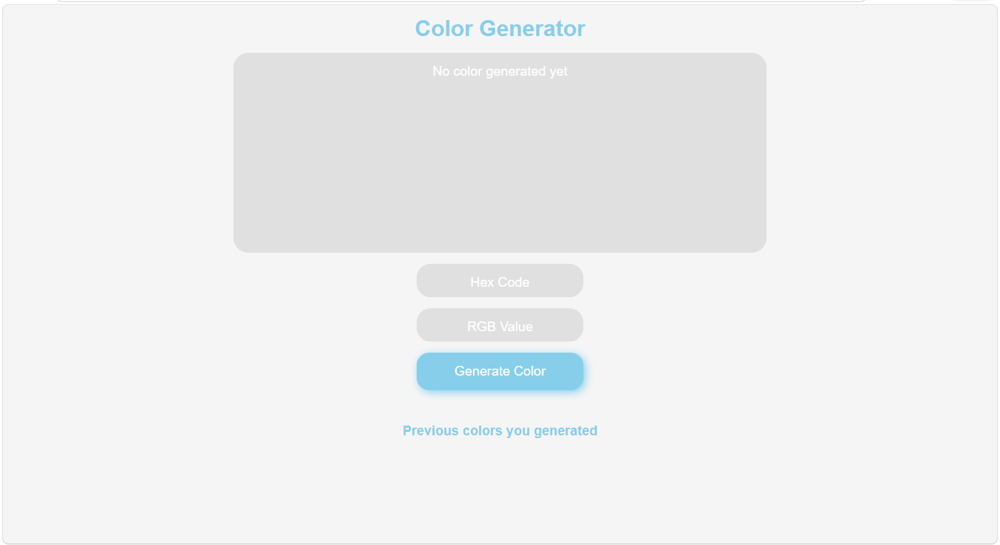

# Random Color Generator

A clean, interactive color tool built with vanilla HTML, CSS, and JavaScript.

🔗 **Live Demo**: [sadiksaifi9958.github.io/Random-Color-Generator](https://sadiksaifi9958.github.io/Random-Color-Generator/)

---

## Screenshot



> Generate random colors instantly — with HEX and RGB values, one-click copy, and a color history.

---

## Features

- **Random Color Generation** — generates a new color on every click
- **HEX and RGB Values** — shows both color formats simultaneously
- **Copy to Clipboard** — click the copy icon on HEX or RGB pill to copy the value instantly
- **Copy Feedback** — icon changes to a checkmark to confirm copy
- **Color History** — last 5 generated colors shown as clickable swatches
- **Spacebar Shortcut** — press Space to generate a new color without using the mouse
- **Color Preview Box** — large display area that fills with the generated color

---

## Built With

- HTML5
- CSS3 (Flexbox, Custom Properties)
- JavaScript (DOM Manipulation, Clipboard API, Keyboard Events)

---

## What I Learned

- Converting RGB values to HEX using `.toString(16)` and `.padStart()`
- Using the Clipboard API — `navigator.clipboard.writeText()`
- Keyboard events — `document.addEventListener("keydown")`
- Dynamic DOM rendering — creating and clearing elements on each interaction
- Event delegation — listening on parent elements instead of dynamic children
- `setTimeout` for timed UI feedback
- Array methods — `unshift()` and `slice()` for managing color history

---

## Getting Started

To run this project locally:

```bash
git clone https://github.com/sadiksaifi9958/Random-Color-Generator.git
cd Random-Color-Generator
```

Then open `index.html` in your browser or use Live Server in VS Code.

---

## Project Structure

```
Random-Color-Generator/
├── index.html
├── style.css
├── script.js
└── app.png
```

---

## Author

**Sadik Saifi**
- GitHub: [@sadiksaifi9958](https://github.com/sadiksaifi9958)
- LinkedIn: [sadik-saifi-934794353](https://linkedin.com/in/sadik-saifi-934794353)

---

## License

This project is open source and available under the [MIT License](LICENSE).